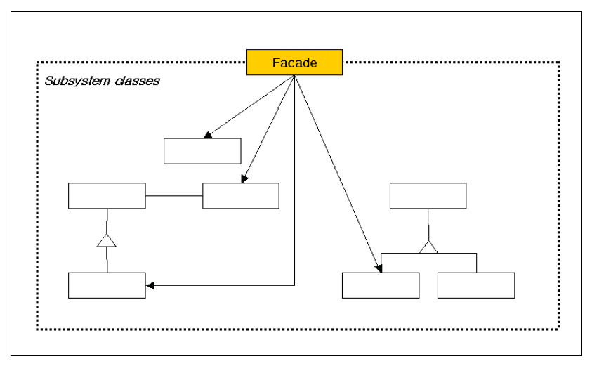
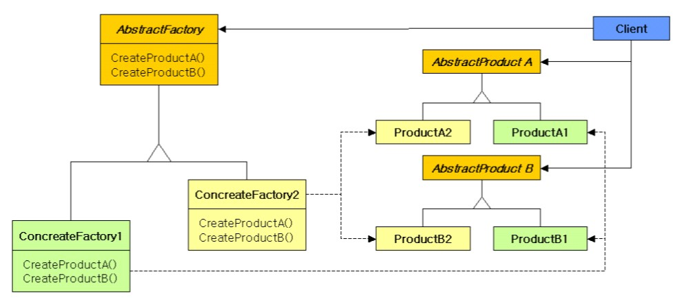

### 2021-03-22

## 파사드 패턴


- __정의__
    - 서브 시스템에 있는 인터페이스 집합에 대해서 하나의 통합된 인터페이스를 제공
        - 서브 시스템을 조금 더 사용하기 편하게 하기 위해 높은 수준의 인터페이스를 정의
    - 코드 중복과 직접적인 의존을 해결하는데 도움을 주는 패턴

- __참여 객체__
    - Facade
        - 단순하고 일관된 통합 인터페이스를 제공
        - 서브 시스템을 구현하는 어떤 클래스가 어떤 요청을 처리해야 하는지를 알고있음
            - 클라이언트의 요청을 서브시스템 객체에게 전달
    - Subsystem Classes
        - 서브 시스템의 기능을 구현
        - Facade 객체에 의해 할당된 작업을 실제로 처리
            - but, Facade의 존재를 모름

- __장점__
    - Facade에게 얻고자 하는 정보에 대한 요청을 보내면 되니, 클라이언트의 코드가 간결해진다
    - 클라이언트와 서브 시스템 간의 직접적인 의존을 제거한다
        - 이는 클라이언트의 변경 없이 서브 시스템의 변경을 가능케 한다
        
## 추상 팩토리 패턴


- __정의__
    - 구체적인 클래스를 지정하지 않고, 관련성을 갖는 객체들의 집합을 새로 생성하거나, 서로 독립적인 객체들의 집합을 생성할 수 있는 인터페이스를 제공
    - 객체 생성의 책임을 분리
    
- __장점__
    - 클라이언트에게 영향을 주지 않으면서 사용할 제품군을 교체할 수 있음

- __프로토타입 방식의 팩토리__
    - 팩토리가 생성하는 객체가 늘 동일한 상태를 가진다면, 프로토타입 방식의 팩토리를 사용해보자
    - 프로토타입?
        - ?
    - Object.clone()
        - ?
    ``` Java
    public class ProtoFactory {
        private Product productProto;
        
        public ProtoFactory(Product proto) {
            productProto = proto;
        }
  
        public Product create() {
            return (Product) productProto.clone();
        }
    }
    ```