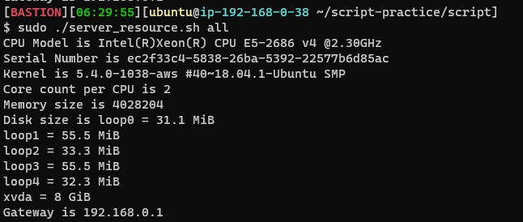
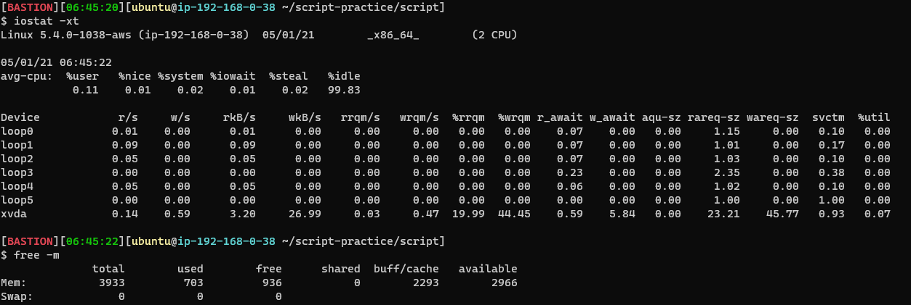

### 2021-05-01

## CU 수업 복습
### 서버 진단하기
- __피해자가 누구인지 파악하는 게 서버 장애 해결의 Key__
    - 브라우저 <-> 웹 서버 <-> 어플리케이션 호스트 <-> DB
        - 웹 서버: nginx 프록시
        - 어플리케이션 호스트: 톰캣, 스프링부트
    1. 접속 로그로 느린 응답 확인
    2. vmstat 등으로 사용률을 파악
        - CPU, Memory는 단위 시간에 평균치... 오류 발생 가능성 Up
        - 대략적인 상태만 파악하는 것
    3. ps로 스냅샷을 찍어, 용의자를 파악

- __stat 형태__
    - 요약 정보 (sar, vmstat)
        - 단위시간 정보의 합계나 평균
    - 스냅샷 (ps, top)
        - 순간의 상태를 기록하여 현재 문제가 발생하고 있지 않은지 원인 조사

- __사용률__
    - 
    - uptime으로 부하 확인
        - 부하가 몰린다: 네트워크 구간에서 부하 몰림
        - 부하가 높다: 서버에서 부하가 높음 
            - 1분, 5분, 15분 사이의 부하 평균치
            - Process가 CPU, I/O에서 대기 상태인 것 
            - 대기하고 있는 작업이 얼마나 대기중인지, 누가 병목인지, 누가 빌런인지 확인
    - oom-killer (dmesg, syslog를 통해 확인)
        - 메모리 사용률이 너무 높아지면, 리눅스 서버가 죽지 않을려고, 너무 메모리 많이 차지하는 프로세스 죽임
    - vmstat
        - OS 커널에서 취득할 수 있는 정보 확인
        - swap-in, swap-out
            - 캐시 적용이 제대로 안될 확률 high
        - block 상태에 있는 프로세스 확인해보기
    - 
        - iostat: 디스크 사용률 확인
            - read/write양
        - free: 메모리 사용률 확인

- __포화도__
    - wait: 대기하고 있는 프로세스들
    - CPU 사용률 100%는 최적화된 상태
        - 그 이상으로 요청이 오면 그게 부하

- __네트워크__
    - active: CLOSED -> SYN-SENT
    - passive: 실제 요청을 받기 시작함
    - TCP
        - TIME_WAIT (잘 모르겠음)
            - ACK 패킷이 유실 된 경우
            - 연결 끊는 쪽에서 TIME_WAIT 소켓 생성
            - 연결 해제 자연스러운 현상
            - 로컬의 포트 고갈에 따른 애플리케이션 타임아웃 발생
                - TCP connection 생성/해제 많아지면 응답속도 낮아질 수 있음
                - keepalive, connection pool등을 이용해 연결 재사용할 것
                    - 소켓을 할당할 포트가 없어
                    - 소켓을 재사용 해보자
        - CLOSE_WAIT (잘 모르겠음)
            - close()
            - 이미 장애가 발생한 경우
            - 서버가 연결을 해제하겠다는 요청 받았는데, 제대로 해제 못한 경우
                - 너무 많은 부하가 있는 경우 발생
                - 부하: 대기중인 프로세스 수
            - 부하를 낮은 상태로 유지하자
            
- __USE 방법론__
    1. 에러 확인한다
    2. 서버의 CPU, Memory, Disk, NW 사용률을 파악한다
    3. 문제를 발견했다면, 부하가 어느 정도 몰렸는지 확인해본다

### 애플리케이션 진단하기
- __Thread__
    - Thread: 프로세스 내의 시간의 흐름
        - Program Counter로 흐름 추적
    - 애플리케이션의 Thread 상에서 나타나는 문제는 대부분 Lock으로 발생
        - Thread가 BLOCKED인지?
        - 하나의 Thread가 너무 오래 Core를 점유하고 있는 거 아닌지?
    - fastthread.io로 dump 내용 웹으로 볼 수 있음

## 질문
- 프로세스 상태
- 소켓?
- TCP vs UDP
- Connection Pool?
- Process vs Thread
- Thread Dump?