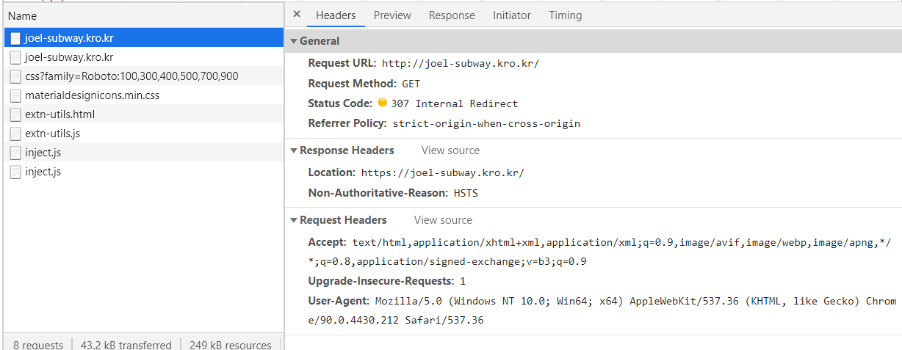
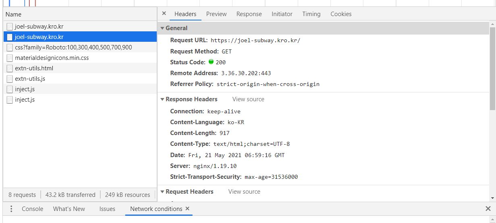

### 2021-05-21

## nginx.conf
- *참고 1: https://whatisthenext.tistory.com/123*
- *참고 2: http://nginx.org/en/docs/http/ngx_http_upstream_module.html*
- __Nginx의 역할__
    - 정적 파일을 처리하는 HTTP 서버로서의 역할
    - 응용프로그램 서버에 요청을 보내는 리버스 프록시로서의 역할

- __nginx.conf 살펴보기__
    - Nginx가 동작해야 할 방식을 설정값을 통해 지정
    ```
    events {}
    
    http {
      # 프록시된 서버들의 그룹 정의
      upstream app {
        server 192.168.0.254:8080;
      }
    
      # Redirect all traffic to HTTPS
      server {
        listen 80;
        return 301 https://$host$request_uri;
      }
    
      server {
        listen 443 ssl;
        ssl_certificate /etc/letsencrypt/live/joel-subway.kro.kr/fullchain.pem;
        ssl_certificate_key /etc/letsencrypt/live/joel-subway.kro.kr/privkey.pem;
    
        # Disable SSL
        ssl_protocols TLSv1 TLSv1.1 TLSv1.2;
    
        # 통신과정에서 사용할 암호화 알고리즘
        ssl_prefer_server_ciphers on;
        ssl_ciphers ECDH+AESGCM:ECDH+AES256:ECDH+AES128:DH+3DES:!ADH:!AECDH:!MD5;
    
        # Enable HSTS
        # client의 browser에게 http로 어떠한 것도 load 하지 말라고 규제합니다.
        # 이를 통해 http에서 https로 redirect 되는 request를 minimize 할 수 있습니다.
        add_header Strict-Transport-Security "max-age=31536000" always;
    
        # SSL sessions
        ssl_session_cache shared:SSL:10m;
        ssl_session_timeout 10m;
    
        location / {
          proxy_pass http://app;
        }
      }
    }
    ```
    - 
        - http://로 요청이 가면 https://로 리다이렉트 하도록 nginx 설정해둠
    - 
        - 이게 그 결과