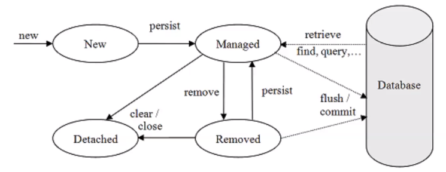

### 2021-06-28

## JPA 제이슨
- **마음 한편에는,,,**
    - Dao가 서로 의존해서 객체를 만들어야 할지 고민
    - 부모 자식 관계가 삭제되면 DB에 자동 반영될 수는 없나?

- **태초에,,,**
    - 객체 지향 패러다임
        - 시스템을 구성하는 객체들에게 적절한 책임 할당
            - 상속
            - 연관관계
        - 자유롭게 객체 그래프를 탐색할 수 있어야 함
    - 테이블
        - 방향성이 서로 없어 
            - A JOIN B를 하던
            - B JOIN A를 하던

- **SQL을 직접 작성하는 것의 문제점,,,**
    - 반복 작업
        - 새로운 필드 추가되면 SQL 다 추가해줘야해
    - 신뢰성
        - 개발자들이 Dao에서 조회해 온 엔티티 신뢰할 수 없다        
        
- **JPA (ORM Framework)**
    - hibernate 구현체
    - 장점
        - DB 스키마 자동생성 (내가 만든 객체를 기준으로!)
            - JPA가 보고 오? 이거 이런 테이블 만들면 되겠구나!
                - "spring.jpa.hibernate.ddl-auto=create"
                    - create: 기존 테이블 삭제 후 생성
                    - create-drop: create와 같으나 종료시점에 테에블 DROP
                    - update: 변경된 부분만 반영
                    - validate: entity와 table이 정상 매핑되었는지만 확인
                    - none: 사용하지 않음
    - 실습
        - 의존성
            - implementation 'org.springframework.boot:spring-boot-starter-date-jpa'
        - 사용법
            - 객체에 `@Entity`를 추가
            - 파라미터 없는 생성자 만듦 *(리플렉션과 비슷한 기술 사용함)*
            - Entity에 PK를 등록해주기 + Auto-increment 설정
                - `@Id` 어노테이션 붙여주기
                - `@GeneratedValue()`를 통해 어떻게 Id값 관리할지 지정
                    - strategy = GeneratedType.IDENTITY
                    - strategy = GeneratedType.SEQUENCE // PK 값 관리 테이블 별도 지금
                    - strategy = GeneratedType.AUTO // DB 벤더사에 의존적이라 위험함
            - `@Table(name = "station")` 매핑할 테이블 이름 지정
                - 안해주면 그냥 엔티티 이름이 테이블 이름
            - `@Column(nullable = false)`
                - 해당 필드는 not null!
                - DB 스키마 상에서 null이 될 수 없다는겨
                - `@NotNull` 이거랑은 달라

- **Spring Data JPA**
    - save(), findBy~()와 같은 반복작업을 
        - CRUDRepository를 만들어뒀어
        - JpaRepository<Station, Long> // 객체와 ID의 형
    - findByName() 과 같은 기능도 자동완성 해줄수 있어
    ```java
    public interface StationRepository extends JpaRepository<Station, Long> {
        Optional<Station> findByName(String name);
        List<Station> findAllByName(String name);
    }
    ```
    - 테스트 코드 작성
        - `@DataJpaTest`를 통해 필요한 설정 해둘 수 있음
        
- **영속성 컨텍스트**
    - 엔티티를 영구 저장하는 환경
    - 엔티티 매니저는 한 트랜잭션당 엔티티 매니저 생성함
    - 엔티티 매니저 팩토리는 하나만 생성
    - 엔티티 매니저로 엔티티 저장/조회 시 엔티티 매니저는 영속성 컨텍스트에 엔티티 보관/관리
        - 1차 캐시
        - 동일서 보장
        - 트랜잭션 지원 쓰기 지연
        - 변경 감지 
        - 지연 로딩
    - id를 key값으로 Entity를 value로
        - 캐시에 있으면 해당 Entity 반환
        - 캐시에 없으면 DB에 Entity 조회해서 반환
    - 엔티티의 생명주기
        - 비영속: 방금 인스턴스 생성한거 (메모리엔 있는데 DB/영속성 컨텍스트는 모름)
        - 영속: 영속성 컨텐스트에 저장한 상태
        - 준영속: 영속성 컨텍스트에 저장했다가 분리된 상태 (트랜잭션 벗어난 경우)
        - 삭제: 삭제된 상태
        - 
    - Transaction이 없으면 동작하지 않아!     
        - EmbeddedTomcat 하나의 요청 당 하나의 쓰레드, 하나의 트랜잭션
            - 하나의 요청에 대해 캐싱 동작
    - `@Transactional`
        - 트랜잭션 커밋하는 순간 영속성 컨텍스트 ---> 데이터베이스
        - commit & flush
    - 쓰기지연 SQL 저장소
        - INSERT QUERY 등
        - 여기에 쿼리를 쌓아 두었다가 commit() 되면 이거 촤르르 flush()
            - 이게 쓰기지연
    - 변경 감지
        - SNAPSHOT과 ENTITY를 비교하여 달라졌다면 update query 생성후 commit()
        - 마치 컬렉션을 다루듯이 DB를 사용하자
        ```java
        @Test
        public void update() {
            final Station station = stations.save(new Station("잠실역"));
            station.changeName("잠실나루역");
            // 변경 감지하고 update 쿼리 커밋한다
            final Station actual = stations.findByName("잠실나루역");
            assertThat(actual).isNotNull();
            // 여기서 트랜잭션 커밋
        }
        ```
        - 참고로 1차 캐시론 조회 안댐
            - 1차 캐시 key값은 ID
            - ID를 기반으로 1차 캐시 찌르기 가능
            - ID 기반 아니면 바로 DB를 찔러
        - Id 기반으로 찌르지 않는 친구들을 "JPQL"이라고 함
            - 직접 쿼리를 생성하는 것
