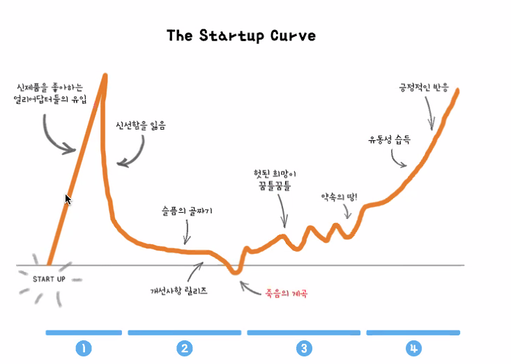

### 2021-07-11

## [초기 VC는 어떤 스타트업에 투자할까?] 풍성이형 특강
- **VC란??**
    - 스타트업에 투자하는 회사
    - 데스밸리 -> 스케일업 
        - 그때 그때 마다 필요한 돈을 투자
        - seed -> 시리즈A -> 시리즈B -> 시리즈C
        
- **아마존은 뭐하는 곳인가?**
    - Customer Obsession
    - 고객에게 어떠한 가치를 주는가?
        - 고객은 자기가 낸 비용보다 더 많은 가치를 느낄 때 돈을 낸다

- **시장의 원천**
    - 욕망을 만족시키는 서비스
        - ex. 타로 챗봇, 연예인, MBTI
        - 트렌드는 항상 바뀌어,,,
            - VC가 초반에 검토하기 힘들어
            - SNS 같은 것들 있자나? 이런 거는 특출나지 않으면 투자 힘들어
            - 진짜 투자 못받았다,,, IR에서 걸러
    - 문제를 푸는 서비스
        - 특정한 문제를 풀면, 문제를 겪는 고객들이 이 서비스 이용할 것
        - 문제를 푼다 == 욕망 만족
            - 비슷하긴 한데 말이지

- **그걸 기반으로 어떻게 검토할까?**
    - 왜 지금 이 팀이 이 문제를 가장 잘 풀 수 있는지!
        - Why Now
            - 아이디어, 팀, 비즈니스모델, 펀딩, 타이밍
            - 야! **타이밍**이 가장 중요해
            - 왜 5년 전은 너무 빨랐고, 5년 후는 너무 늦을까?
                - 기존 기업들이 포착하지 않/못하고 있는 곳은 어떤 허들이 존재
                - 허들이 허물어지는 3가지 요인
                    - 사회 구조의 변화
                        - OKHOME
                        - 프로덕트 헌트
                    - 기술의 변화
                        - AI 기반 스타트업
                    - 인식의 변화
                        - 마이리얼트립
                        - 에어비앤비
            - 지금까지 왜 없었지? 왜 팀은 잘하지?
        - Team
            1. 고객이 원하는 것을 잘 만들수 있는 역량이 이 팀에 있나?
                - 고객이 원하는 것을 만들지 못한다면 그것은 분명히 실패로 귀결!
                - Key Success Factor는 무엇일까?
                    - ex. 루닛: 얼마나 정확도 높은 AI 솔루션을 제공하는가?
            2. 팀이 얼마나 끈끈하고 Mission-Driven 한가?
                - 
                - 이러한 역경들이 있어도 버틸라면 미션이 확실해야함
            - 우리가 팀을 짠다면?
                - 우리기 때문에 가장 잘 풀 수 있는 영역이 있음
                    - MZ 세대를 위한 서비스
                    - 학생들이 겪는 문제를 푸는 서비스
                    - 학생이라도 오랜기간 관심 가졌던 영역
        - Problem
            - 문제를 겪는 고통의 크기 * 사람의 수 = 시장의 크기
            1. 문제가 진짜 문제인가?
                - 나만 겪는 문제는 아닌지
                - ex. 샌드버드: 창업가 개발하면서 채팅 구현 어려움 몸소 느낌
            2. 문제가 얼마나 심각한가?
                - 고통의 크기가 클수록 더 많은 가치
                - ex. 샌드버드: 중요한 기능임에도 안정적 운영 어려움
            3. 그 문제를 얼마나 많은 사람들이 겪는가?
                - Top Down + Bottom Up
                - ex. 샌드버드: IT 서비스 엄청 많음, 꼭 필요한 피쳐임
            4. 영속적인 문제인가?
                - ex. 엑스클로젯: 온라인 명품 중고거래 플랫폼
                    - 당근마켓이 하면 어쩌려고?
                        - 일반인 진품 검수 어려워
                        - 방향성이 달라
        - Solution
            - 진짜 심각한 문제인데 경쟁자가 없다? -> 의심해볼 것
            - 보통은 같은 문제를 다양한 접근으로 푸는 경쟁자가 무조건 있어!
            - 그럼에도 우리 솔루션이 가장 좋은 접근인 이유?
                - **프로덕트 우위!**
                    - 유저 경험! *이전 보다 10배 더 편한것?*
                    - 데이터! -> 더 좋은 유저 경험!
            - 실행력
                - 실험을 반복하며 Best Fit을 찾아가는 과정
                - 경쟁사보다 빠르게 실행하여 좋은 유지 경험 지속하기
                - ex. 스프린트: 사진 찍어 올리면 일일이 뒤지게 칼로리 계산해줌
                    - but Scale Up이 좀 힘들어보여,,,
                    - AI 할 줄 아는 사람도 없고
            - 결국 초기 스타트업은 팀을 보고 투자 한다!
            1. 이제까지 어떤 솔루션이 있었나?
            2. 그 솔루션이 적절한 솔루션인가?
            3. 해당 솔루션이 모방하기 쉬운가?
            - 마켓컬리 대표님의 강연
                - 내가 잘 이해하고 공감하는 문제인가
                - 정말 열정을 가지고 풀 수 있는 문제인가?
                - 내가 잘 풀어낼 자신이 있는 문제인가?
                - 내가 꼭 해결하고 싶은 문제인지?

- **큐앤에이**
    - Qs. 문제를 푼다? == 고학력자?
        - 석박까지는 아니더라
        - 별로 저학력자라도 자기만의 고민을 통해 엣지를 
        - 좋은 학교에 있는 사람들이 주로 관심갖더라
    - Qs. AI를 잘하는 걸 어찌 판단해?
        - 초반에 없어도 굳이 안봐
        - 레퍼런스 체크
        - 팀원도 투자과정에서 만나게 됨
        - 커뮤니케이션을 많이 하면서 검토
    - Qs. AI 모델링까지 하는 스타트업은 얼마나되나?
        - AI가 정말 중요하다면, AI 팀원들이 정말 좋아야겠지?
        - 증강현실 쇼핑 SAAS 플랫폼 (API 제공)
            - 판매사들이 몇 번 사진을 찍으면 뚝딱 제공
        - AI가 본질이 아닌 스타트업이라면 굳이?
    - Qs. 주니어로써 VC에서 어떤 일을 했을까?
        - 스타트업 시장 리서치 지원
        - 현재 시장 트렌드 분석
        - 회의 parsing
        - 구글 리서치, 직접 가서 보기
    - Qs. Seed -> 시리즈 A/B/C 얼마나 넘어가는지 몇 프로나?
        - 글쎄다...
    - Qs. 사회적 기업은 BM이 없어도 투자 받을 수 있나?
        - 당근마켓도 초반엔 BM 없었어
