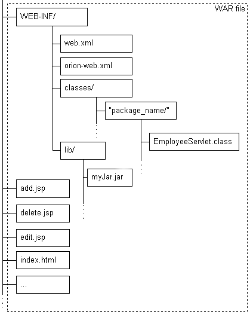

### 2021-09-08

## 서블릿
- **서블릿이란?**
    - 자바를 이용한 동적인 웹 처리
    - 자바로 HTTP 요청 및 응답을 처리하기 위한 표준
        - Jakarta Servlet defines a server-side API for handling HTTP requests and responses
    - 서블릿 표준은 인터페이스로 제공
    - 해당 인터페이스를 구현한 서블릿 컨테이너들
        - Tomcat, Jetty, Undertow
            - Spring: Tomcat 기본 내장
            - SparkJava: Jetty 기본 내장

- **서블릿 구현 방식**
    
    - HTML/JSP 같은 정적 파일들은 루트 디렉토리에 배치
    - 컴파일된 서블릿 클래스는 /WEB-INF/classes 디렉토리에 배치
    - 라이브러리 파일은 /WEB-INF/lib 디렉토리에 배치
    - 어노테이션, xml 방식으로 서블릿 구현할 수 있음

- **서블릿 컨테이너**
    - 동적 웹 처리를 위해 dynamically generate the web page on the server-side
    - 하는 일
        - 통신 지원: 웹서버 <-> 서블릿 통신 API
        - Lifecycle 관리: init -> service -> destory
        - 멀티스레딩 지원
    - 처리 순서
        1. 사용자가 HTTP 요청을 서버에 보냄
        2. 서블릿 컨테이너가 HttpServletRequest, HttpServletResponse 객체 생성
        3. 서블릿은 요청을 처리할 수 있는 서블릿 찾아 스레드 할당, request/response 객체 전달
        4. 서블릿 컨테이너 service() 메서드 호출 ==> doGet(), doPost() 등 호출
        5. 처리 이후 컨테이너에게 응답 객체 전달

- **서블릿 컨테이너의 멀티쓰레딩**
    - 서블릿 컨테이너는 각 서블릿 객체를 하나씩만 만듦
        - 서블릿 객체는 thread-safe 보장해야함
    - 서블릿 컨테이너는 쓰레드 풀을 사용해 쓰레드 만들어두고 재사용
    - *참고 1: https://tomcat.apache.org/tomcat-8.5-doc/config/executor.html*
    - *참고 2: https://tomcat.apache.org/tomcat-8.5-doc/config/http.html*
    ```xml
    <Connector port="8080" protocol="HTTP/1.1" 
               connectionTimeout="10000" 
               redirectPort="8443"  
               maxThreads="200"   
               acceptCount ="100" />
    ```
    - **[maxThreads]** 
        - 처리할 수 있는 최대 동시 요청 수 결정
        - default 200개로 지정
        - CPU 사용량 고려하여 CPU 사용량이 적다면 쓰레드를 좀 더 만들수 있게 하자
    - **[minSpareThreads]**
        - 항상 살아있는 최소한의 쓰레드 수
            - active, idle 모두 포함
        - default 25개로 지정
    - **[acceptCount]**
        - queue에 저장 가능한 최대 요청수 설정
        - 대기열이 가득차면 OS가 추가 연결을 거부하거나 연결 시간 초과될 수 있음
        - 기본값 100

- **서블릿 필터**
    - 서블릿으로 요청이 전송되기 전에 추가적인 처리 하고 싶을 때 적용
        - ex. 서블릿의 요청의 로그를 쌓을 수 있음
        - ex. 서블릿 시작/종료 시간 로그로 기록해 호출 지연되는 부분 탐색

## 네트워크 관련 키워드
- 이더넷
- 맥주소
- 포트 포워딩
- 리다이렉트 vs 포워드
