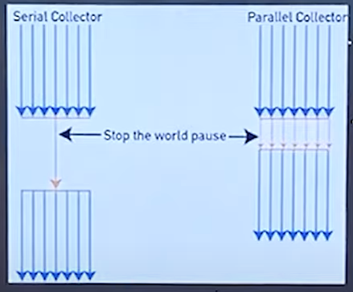
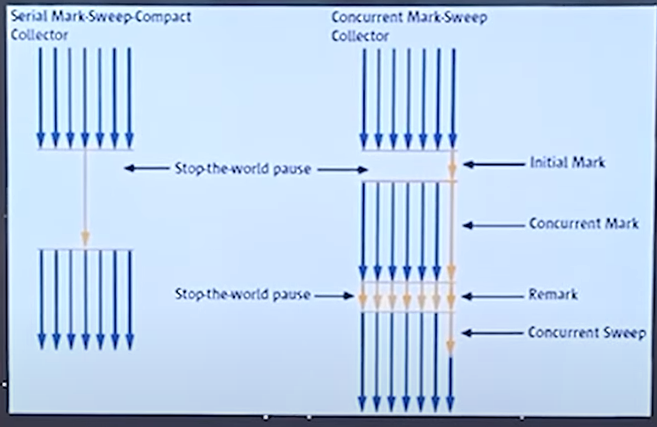

### 2021-09-19

## 테코톡 - JVM GC
- *참고: https://www.youtube.com/watch?v=vZRmCbl871I&list=PLSnmzK8DduHIcb_FsgG-yjXYARCKCKwzh&index=3&t=717s*
- **JVM**
    - 운영체제의 메모리 영역에 접근하여 메모리를 관리하는 프로그램

- **GC**
    - 동적으로 할당한 메모리 영역 중 사용하지 않는 영역을 탐지하여 해제하는 기능
    - 동적 할당: HEAP
        - 모든 Object 타입의 데이터가 할당. 
        - Heap 영역의 Object를 가리키는 참조변수가 stack에 할당
    - Stack: 정적으로 할당한 메모리 영역
        - 원시 타입의 데이터가 값과 함께 할당. 
        - Heap 영역에 생성된 Object 타입의 데이터의 참조 값 할당
    - Stack 할당된거 다 POP되고, HEAP에 남은 참조가 끊긴 친구들,,, unreachable object => GC의 대상

- **GC 과정**
    1. Stack의 모든 변수 스캔하면서 각각 어떤 객체 참조 중인지 찾아서 마킹 - MARK
    2. Reachable Object가 참조중인 객체도 찾아서 마킹 - MARK
    3. 마킹 안된 객체 Heap에서 제거 - SWEEP
    - Mark And Sweep 과정!

- **GC 언제 일어남?**
    - Heap의 구조
        - New Generation: Eden / Survival 0 / Survival 1
        - Old Generation
    - 새로운 객체는 Eden 영역에 할당
    - Eden 꽉 차면 Minor GC 발생
        - Eden 영역에 대해서만 Mark And Sweep
        - Eden 영역 중 Reachable 객체는 Survival 0 으로 옮겨짐
        - Eden 영역 중 Unreachable 객체는 메모리에서 해제
    - Survival 0 영역이 꽉 참 Minor GC 발생
        - Survival 0에서 Mark And Sweep
        - 살아남은 놈들 다 Survival 1 영역으로 이동
            - 이동한 객체는 Age 값이 증가
    - Survival 1 영역이 꽉 참 Minor GC 발생
        - Survival 1에서 Mark And Sweep
        - 살아남은 놈들 Survival 0 영역으로 이동
            - 이동한 객체 Age 값이 증가
    - 특정 Age 값 넘어가면 Old Generation으로 Promotion
    - Old Generation 영역 꽉차면 Major GC 발생

- **GC의 종류**
    - Stop-The-World
        - GC를 실행하기 위해 JVM이 애플리케이션 실행 멈추는 것
        - GC 수행하고 중단한 작업 다시 실행
        - 
        - 
    - Serial GC
        - GC를 처리하는 스레드가 1개
        - CPU 코어가 1개만 있을 때 사용
        - Mark-Compact Collection 알고리즘
    - Parallel GC 
        - GC 처리 쓰레드 여러개
        - 코어 갯수 많을 때
    - Concurrent Mark Sweep GC
        - stop the world 줄여!
            - initial Mark: 멈추고 살짝 검토
            - concurrent Mark: 다른 어플리케이션 쓰레드와 동시에 수행하면서, 객체 그래프 타고가면서 계속 마크해!
            - remark: 멈추고 찐 리마크
            - concurrent Sweep: 찐 해제
        - 애플리케이션 응답시간이 빨라야 할 때 사용
        - 다른 GC 방식보다 메모리/CPU 많이 사용
        - Compaction 사용 안함
    - G1 GC
        - GC 일어날 때 전체 영역을 탐색하지 X
        - 바둑판의 영역에 객체를 할당하고 GC 실행
        - 그러다가, 해당 영역이 꽉 차면 다른 빈 영역에 객체 할당하고 GC 실행
        - G1 GC STW 시간 짧음
        - Compaction 사용
        
        