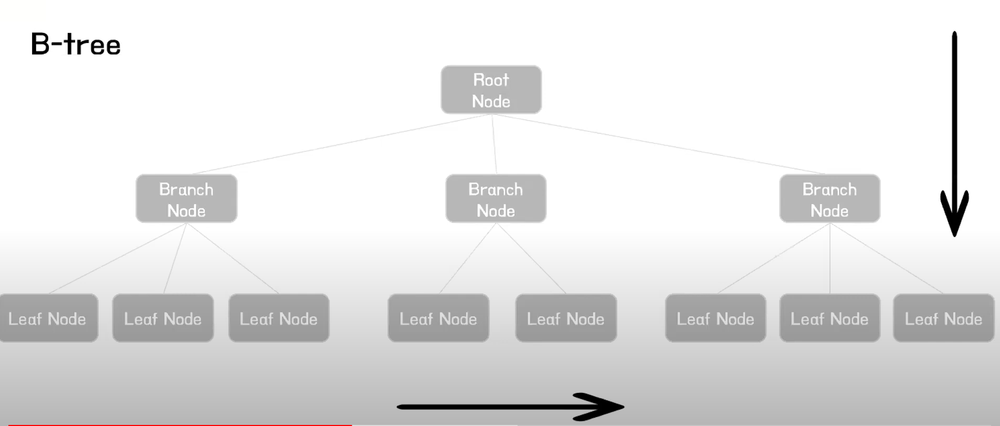

### 2021-09-23

## DB 인덱스
- *참고 1: https://www.youtube.com/watch?v=9ZXIoh9PtwY&t=252s*
- *참고 2: https://www.youtube.com/watch?v=NkZ6r6z2pBg&t=590s*
- *참고 3: https://www.youtube.com/watch?v=P5SZaTQnVCA&t=569s*
- **Index 사용 이유**
    - 대용량 데이터에서 원하는 데이터를 빠르게 조회하기 위함
    - 대용량 데이터 조회 시 SELECT 쿼리 조회 속도 향상을 위함
    - 단 Insert, Update, Delete 시 성능 조금 희생

- **Index의 작성/삭제**
    - Index도 하나의 DB 객체 (저장된 데이터의 10% 정도의 공간 필요!)
        - Oracle, DB2 등에서는 스키마 객체
        - MySQL, SQL Server 등에서는 테이블 내의 객체
    ```mysql
    create index IDX_FIRST_NAME ON employees(first_name)
    
    drop index IDX_FIRST_NAME ON employees
    ```

- **Full Table Scan**
    - 원하는 데이터 찾을때 싹 다 돌아버려
    - 대용량 데이터에 비효율적

- **B-tree**
    - 자식 노드의 갯수가 2개 이상인 트리
    - 
    - 수직적 탐색, 수평적 탐색
        - 수직적으로 조건 알맞는 Branch Node 찾고
        - 수평적으로 조건 알맞는 Leaf Node 찾기

- **Clustered vs Non-Clustered**
    - Clustered: 인덱스 안에 데이터가 포함됨
    - Non-Clustered: 인덱스 안에 데이터 없음

- **Clustered Index**
    - PK: Clustered index 자동 생성
    - 특징
        - 테이블 당 1개만 존재
        - PK 제약조건으로 칼럼 생성하면 자동 생성
        - 리프 페이지 == 데이터 페이지
        - 데이터가 정렬된 상태

- **Non-Clustered Index**
    - 특징
        - 테이블에 여러개 존재 가능
        - Unique 제약 조건으로 컬럼 생성시 자동 생성
        - 인덱스와 데이터 페이지 따로 존재
        - 리프 페이지에서 데이터가 있는 곳의 주소를 가짐
        - 데이터 페이지에 데이터가 정렬되지 않아도 됨
        - Clustered에 비해 SELECT 약간 느림, INSERT/UPDATE/DELETE 시 부하 적음

- **인덱스를 언제 쓸까?**
    - SELECT FROM WHERE: 성능 굿! 조회 빨리 할 수 있음
    - INSERT: 성능저하, 비트리에 우겨넣는거랑 비슷하다고 생각
    - DELETE: 성능저하, 비트리에 삭제하는것과 비슷
    - UPDATE: 성능저하, DELETE 후 INSERT 하는 방식으로 구동됨

- **인덱스 Column 설정 기준**
    - Cardinality가 높은 것을 인덱스의 기준으로 삼자!
        - 성별로 거를지, 닉네임으로 거를지, 주민번호로 거를지? ==> 고유하게 거를값!
        - 고유한 수가 많은 것!
    
## DB Key Point
1. OLTP
2. ACID
3. MVCC

## 네트워크 관련 키워드
- 이더넷
- 맥주소
- 포트 포워딩
- 리다이렉트 vs 포워드

## NGINX 작동법
- server_name, default_server?
- referer vs origin 
- https reverser
- nginx 변수

## 컨테이너 네트워크

## 정적 분석
