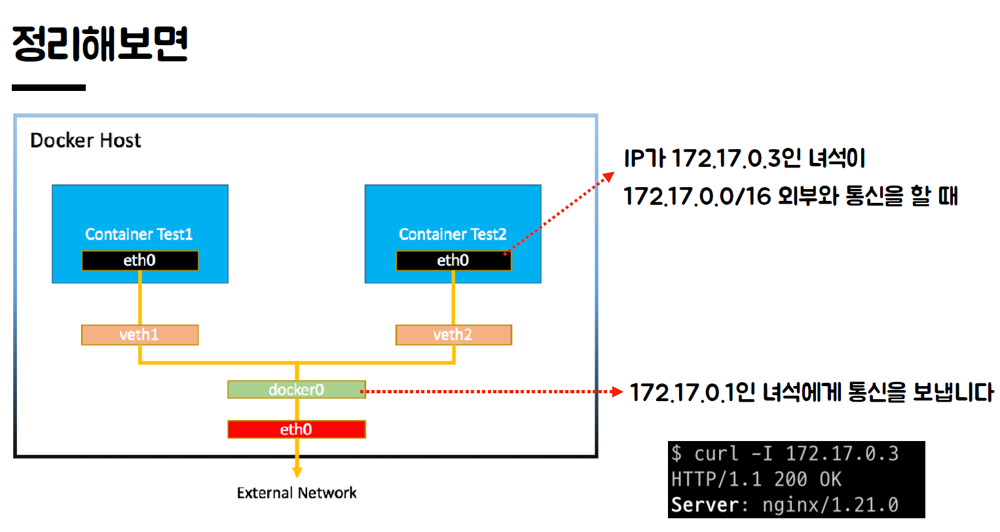

### 2021-09-24

## DNS
- *참고: https://www.youtube.com/playlist?list=PLuHgQVnccGMCI75J-rC8yZSVGZq3gYsFp*
- **서버와 클라이언트 입장**
    - Server: ip와 이름을 DNS에 등록
    - Client가 랜선/와이파이로 인터넷 접속하면, DNS의 ip주소가 internet provider에 의해 자동 세팅됨 (dhcp)
    - Client: 이름에 접속 -> 호스트 파일에 없음 -> DNS에 ip 질의 -> ip 응답받음 -> 그걸로 접속

- **등록 과정!**
    - ICANN: 전세계 ip 주소 관리, 루트 네임 서버의 관리 (인터넷 체계 관리자)
        - Root name server (a~m.root-servers.net)이 전 세계에 흩어져서 관리됨
            - 수백개의 성능좋은 서버들이 전세계에 있음
        - com, net 등 도메인이 어떤 Registry에서 관리되는지를 저장
        - `com NS a.gtld-servers.net` 을 저장
    - Registry: .com, .net 등 탑 레벨 도메인 관리
        - authoritative name server를 저장해둠
        - `example.com NS a.lana-servers.net` 을 저장
            - NS 레코드를 저장!
    - Registrar 등록 대행자
        - authoritative name server를 통해 도메인을 등록하자
        - example.com 과 내 IP를 연결
        - `example.com A 93.183.21.39` 를 저장
            - A 레코드를 저장!

- **접속 과정**
    - 클라이언트가 LAN/와이파이 꽂으면 ISP가 DNS 서버 ip 세팅함
        - 전 세계에 있는 모든 DNS 서버는 Root Name Server를 알고 있음!
    - 
    - 

- **public dns**
    - dns server를 원래 isp가 자동으로 제공
    - 자신이 원하는 dns server를 통해 ip 주소 조회하도록 변경할 수 있음
        - 1.1.1.1 cloudflare가 만든 걸로 바꿔봄

- **nslookup**
    - 
    - `nslookup -type=a joel-dev.site`
        - joel-dev.site의 A 레코드를 조회 (타입 안쓰면 이게 디폴트)
        - DNS로 부터 순차적으로 NameServer-Registry-Registrar 조회하고 Registrar 등록 대행자에서 ip 주소와 도메인 정보를 가져옴
        - 하지만 dns를 통해 가져온 친구들이 캐싱 및 원본 출처에서 직접 가져온게 아니니 권한없는 응답이라고 뜬것이여
    - `nslookup -type=ns joel-dev.site`
        - joel-dev.site의 네임 서버를 조회해와라
        - 나는 가비아에서 등록했으니까, 가비아의 주소 반환
    - `nslookup joel-dev.site ns.gabia.co.kr`
        - 이게 가비아 Registrar 등록 대행자에서 joel-dev.site 땡겨와주세요
        - 이러면 이제 원본 출처 명확하니까 권한 없음 생략되어 가져올 수 있지롱

- **DNS record & CNAME**
    - *참고: https://en.wikipedia.org/wiki/List_of_DNS_record_types*
    - DNS record: DNS 서버에 저장하는 어떤 도메인에 대한 정보 1건
        - A 형식: IP 주소와 연결해주세요~
        - NS 형식: 어떤 도메인에 대한 처리를 다른 도메인 네임 서버에 위임해주세요~
        - CNAME 형식: 도메인에 대한 별명을 지정해주세요~

## 도커 네트워크
- **컨테이너 특징**
    - xxx의 라이프사이클 관리
    - 이를 격리하는 역할

- **컨테이너는 프로세스를 관리**
    - 프로세스
        - 실행중인 프로그램으로, '프로그램의 명령'과 '실행시에 필요한 정보' 조합의 오브젝트
        - 프로그램이 OS에 의해 실행되는 단위
        - 저장장치에 있는 프로그램 실행시, 실행할 때의 명령과 실행하는데 필요한 정보들을 메모리에 적재
        - 단일 CPU는 하나의 프로세스만 수행
    - 컨테이너는 프로세스를 추상화!
        - 컨테이너가 프로세스 생성/운영/제거까지의 생애주기 관리
        - 이때 필요한게 격리!
    - 컨테이너는 Host OS의 시스템 커널 사용
    - 하지만 파일시스템은 달라짐
        - chroot: 루트 파일 시스템을 강제로 인식시켜 프로세스를 실행
    - 컨테이너 안에서는 자기가 첫번째!
        - 지가 init 프로세스

- **컨테이너 네트워크**
    - 컨테이너 생성시 => 독자적 파일시스템, 네트워크 인터페이스도 생성됨
        - 컨테이너에 MAC 주소와 IP 주소가 할당되어 있음
        - 해당 컨테이너의 라우팅 테이블에서, 모르는 대역의 경우 172.17.0.1으로 보내라고 설정
        - docker0를 통해 다른 컨테이너에게 통신을 보내게 됨
    - 172.17.0.1??
        - 
        - gateway, 이 네트워크는 bridge를 활용
        - HostOS의 docker0가 점유중
    - 컨테이너마다 부여될 IP 주소 매번 확인 어려움
        - 그래서 포트포워딩을 활용
        - HostOS가 직접 요청을 처리할 수 있게됨!
            - 약간 공유기 공부한거랑 느낌이 비슷한거같기도??
        
## 부하 테스트
- **목표**
    - 완벽한 시스템은 없음. 일정 수준의 장애는 허용할 수 밖에 없음
    - 사용자가 납득할만한 수준의 가용성 & 배포 사이클

- **가용성**
    - 시스템이 서비스를 정상적으로 제공할 수 있는 상태
    - 가용성 높이기 위해 단일 장애점(SPOF) 없애고, 확장성 있는 서비스 만들것
    - 단일 장애점(SPOF)
        - 서버 장비 장애 / 어플리케이션 서버 장애 / DB 서버 장애날 경우 모두 서비스 중단됨
        - 따라서 모든 요소를 이중화 해야 단일 장애점 극복!
    - 다중화
        - 장애가 발생해도 예비 운용장비로 시스템의 기능을 계속할 수 있도록 함
        - 단일 장애점 없애고 다중화하자!
        - Server, Load balancer, Network Device 등의 다중화
        - Master-Slave DB Replication

- **사용자**
    - 성능 테스트 시엔 실제 지연이 발생하는 구간 파악하자
        - 인터넷 구간: 정적 파일 크기, Connection 관리, NW 환경 등
        - Server 구간: DB와 어플리케이션 간 연결의 문제, 프로그램 로직 상의 문제 혹은 서버의 리소스 부족
    - 상위 5%의 화면이 95%의 사용자 요청을 받는다!

- **테스트 종류**
    - Smoke Test
        - 최소한의 부하로 구성
        - 테스트 시나리오 오류 체크
        - 최소 부하 상태에서 시스템에 오류 발생하지 않는지 확인
    - Load Test
        - 서비스의 평소 트래픽과 최대 트래픽 상황에서 성능 확인
        - 어플리케이션 배포 및 인프라 변경 시 성능 변화 확인
        - 외부 요인 (결제 등) 예외 상황 확인
    - Stress Test
        - 서비스가 극한의 상황에서 어찌 돌아가는지 확인
        - 장기간 부하 발생의 한계치 확인, 기능 정상 동작 확인

## 쿠버네티스
