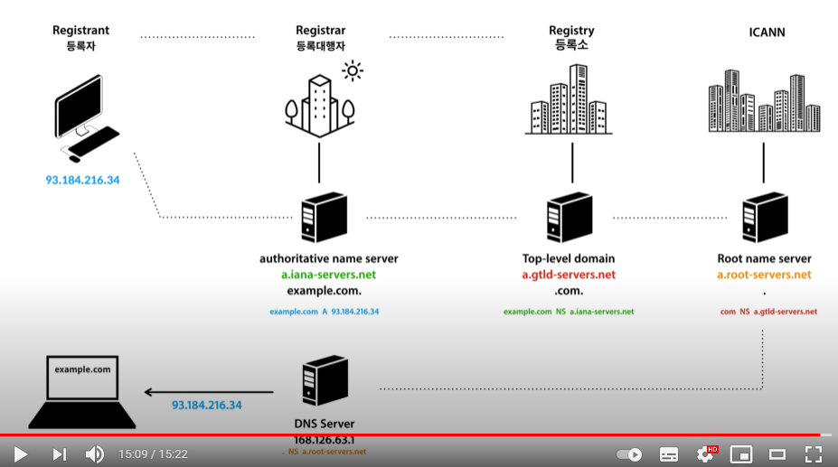

### 2021-09-24

## DNS
- *참고: https://www.youtube.com/watch?v=hfj0IGgKAgU*
- **서버와 클라이언트 입장**
    - Server: ip와 이름을 DNS에 등록
    - Client가 랜선/와이파이로 인터넷 접속하면, DNS의 ip주소가 internet provider에 의해 자동 세팅됨 (dhcp)
    - Client: 이름에 접속 -> 호스트 파일에 없음 -> DNS에 ip 질의 -> ip 응답받음 -> 그걸로 접속

- **등록 과정!**
    - ICANN: 전세계 ip 주소 관리, 루트 네임 서버의 관리 (인터넷 체계 관리자)
        - Root name server (a~m.root-servers.net)이 전 세계에 흩어져서 관리됨
            - 수백개의 성능좋은 서버들이 전세계에 있음
        - com, net 등 도메인이 어떤 Registry에서 관리되는지를 저장
        - `com NS a.gtld-servers.net` 을 저장
    - Registry: .com, .net 등 탑 레벨 도메인 관리
        - authoritative name server를 저장해둠
        - `example.com NS a.lana-servers.net` 을 저장
            - NS 레코드를 저장!
    - Registrar 등록 대행자
        - authoritative name server를 통해 도메인을 등록하자
        - example.com 과 내 IP를 연결
        - `example.com A 93.183.21.39` 를 저장
            - A 레코드를 저장!

- **접속 과정**
    - 클라이언트가 LAN/와이파이 꽂으면 ISP가 DNS 서버 ip 세팅함
        - 전 세계에 있는 모든 DNS 서버는 Root Name Server를 알고 있음!
    - 

## 도커 네트워크

## 쿠버네티스