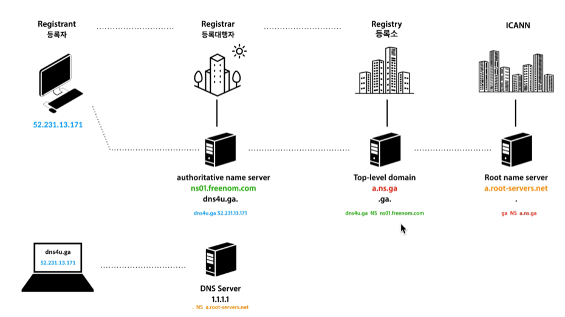
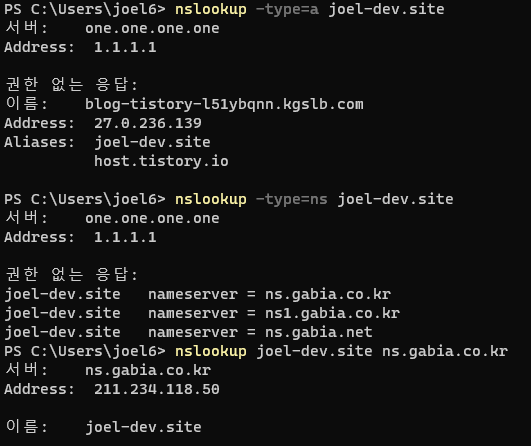

### 2021-09-24

## DNS
- *참고: https://www.youtube.com/playlist?list=PLuHgQVnccGMCI75J-rC8yZSVGZq3gYsFp*
- **서버와 클라이언트 입장**
    - Server: ip와 이름을 DNS에 등록
    - Client가 랜선/와이파이로 인터넷 접속하면, DNS의 ip주소가 internet provider에 의해 자동 세팅됨 (dhcp)
    - Client: 이름에 접속 -> 호스트 파일에 없음 -> DNS에 ip 질의 -> ip 응답받음 -> 그걸로 접속

- **등록 과정!**
    - ICANN: 전세계 ip 주소 관리, 루트 네임 서버의 관리 (인터넷 체계 관리자)
        - Root name server (a~m.root-servers.net)이 전 세계에 흩어져서 관리됨
            - 수백개의 성능좋은 서버들이 전세계에 있음
        - com, net 등 도메인이 어떤 Registry에서 관리되는지를 저장
        - `com NS a.gtld-servers.net` 을 저장
    - Registry: .com, .net 등 탑 레벨 도메인 관리
        - authoritative name server를 저장해둠
        - `example.com NS a.lana-servers.net` 을 저장
            - NS 레코드를 저장!
    - Registrar 등록 대행자
        - authoritative name server를 통해 도메인을 등록하자
        - example.com 과 내 IP를 연결
        - `example.com A 93.183.21.39` 를 저장
            - A 레코드를 저장!

- **접속 과정**
    - 클라이언트가 LAN/와이파이 꽂으면 ISP가 DNS 서버 ip 세팅함
        - 전 세계에 있는 모든 DNS 서버는 Root Name Server를 알고 있음!
    - 
    - 

- **public dns**
    - dns server를 원래 isp가 자동으로 제공
    - 자신이 원하는 dns server를 통해 ip 주소 조회하도록 변경할 수 있음
        - 1.1.1.1 cloudflare가 만든 걸로 바꿔봄

- **nslookup**
    - 
    - `nslookup -type=a joel-dev.site`
        - joel-dev.site의 A 레코드를 조회 (타입 안쓰면 이게 디폴트)
        - DNS로 부터 순차적으로 NameServer-Registry-Registrar 조회하고 Registrar 등록 대행자에서 ip 주소와 도메인 정보를 가져옴
        - 하지만 dns를 통해 가져온 친구들이 캐싱 및 원본 출처에서 직접 가져온게 아니니 권한없는 응답이라고 뜬것이여
    - `nslookup -type=ns joel-dev.site`
        - joel-dev.site의 네임 서버를 조회해와라
        - 나는 가비아에서 등록했으니까, 가비아의 주소 반환
    - `nslookup joel-dev.site ns.gabia.co.kr`
        - 이게 가비아 Registrar 등록 대행자에서 joel-dev.site 땡겨와주세요
        - 이러면 이제 원본 출처 명확하니까 권한 없음 생략되어 가져올 수 있지롱

- **DNS record & CNAME**
    - *참고: https://en.wikipedia.org/wiki/List_of_DNS_record_types*
    - DNS record: DNS 서버에 저장하는 어떤 도메인에 대한 정보 1건
        - A 형식: IP 주소와 연결해주세요~
        - NS 형식: 어떤 도메인에 대한 처리를 다른 도메인 네임 서버에 위임해주세요~
        - CNAME 형식: 도메인에 대한 별명을 지정해주세요~

## 도커 네트워크

## 쿠버네티스