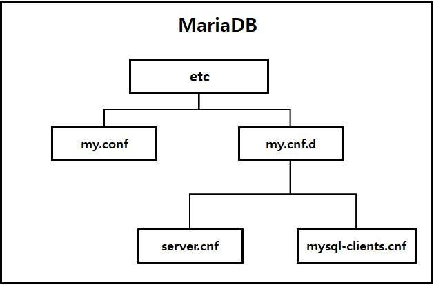

### 2021-09-30

## MySQL 구조
- 데이터를 저장하는 표 (table)
    - 표가 많아짐에 따라 디렉토리마냥 관리하는 필요성이 대두
- 연관된 표들을 그룹핑해서 데이터베이스/스키마 (database)를 만듦
- 스키마들을 저장해두는 데이터베이스 서버 (database server)
    - 우리가 설치한 프로그램은 기본적으로 데이터베이스 서버

## my.cnf 설정
- MariaDB 설정 파일 구조
    - 
    - `/etc/my.cnf`: MariaDB의 주 설정 파일. /etc/my.cnf.d/ 폴더의 파일들을 include
    - `/etc/my.cnf.d`: 이 폴더안에 모든 .cnf 파일들이 실제 설정 파일들. 이 파일들이 my.cnf에 include됨
    - `/etc/my.cnf.d/server.cnf`: 실질적인 서버 설정파일. 서버의 charset
    - `/etc/my.cnf.d/mysql-clients.cnf`: mysql, mysqldump 같은 client app들을 위한 설정 파일
    
## 내 삽질 
- my.cnf에 빈로그 추가하려다가 restart 하니까 아예 구동이 안되더라
    - 시작 못했으니까 여기저기 참고해보라고 알려줌
    - 난 그냥 /var/log/mysql/error.log에서 뭔 일 인지 알아봄
    ```
    2021-09-30  0:28:04 140266459028608 [ERROR] mysqld: File '/home/ubuntu/database_backup/binlog/bin.index' not found (Errcode: 13 "Permission denied")
    2021-09-30  0:28:04 140266459028608 [ERROR] Aborting
    ```
- 뭐 퍼미션이 안되는 구나. 우선 재구동 시키자 하고 빈로그 옵션 지우고 restart
    - 어라 근데 안되네? 
    - 이번에는 다음과 같은 에러로그 /var/log/mysql/error.log
    ```
    2021-09-30  2:05:01 139824495119488 [ERROR] /usr/sbin/mysqld: unknown option '--...'
    2021-09-30  2:05:01 139824495119488 [ERROR] Aborting
    ```
- 쉣,,, 뭔일이다냐
    - 문제는 저기 ... 보이지 중간에
    - 이게 옵션마냥 읽혀서 mysql 데몬을 띄울라는데 "--..." 옵션 이런거 없으니까 화를 낸 듯
    ```shell script
    ubuntu@ip-192-168-1-46:/etc$ cat my.cnf
    [mysqld]
    ...
    character-set-server = utf8
    collation-server = utf8_general_ci
    ```
    - 이거 지워주니까 재구동 됨
    ```shell script
    ubuntu@ip-192-168-1-46:/etc$ cat my.cnf
    [mysqld]
    character-set-server = utf8
    collation-server = utf8_general_ci
    ```