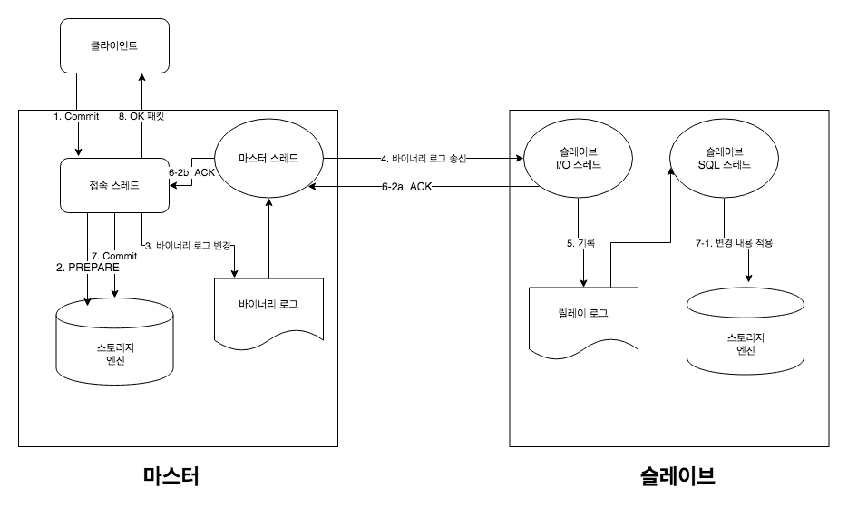

### 2021-10-25

## DB Replication에서 Transaction에 관한 논의
- *참고: https://github.com/woowacourse-teams/2021-nolto/pull/639#pullrequestreview-787599584*
- **나의 질문**
    - 해당 메서드는 피드를 조회해온뒤 수정/삭제 할 때에도 쓰이는 메서드 인데, 그 경우엔 다음과 같이 동작하나요?
        1. Slave에서 feedId로 조회해와 Feed 엔티티 구성
        2. 해당 Feed 엔티티 수정/삭제
        3. 해당 Feed 엔티티 정보 Master에 반영
        4. Master의 binlog 정보로 Slave도 업데이트
    - 아니면 트랜잭션의 전파 설정이 기본값이 부모 트랜잭션으로 합류하는 REQUIRED 이니, 다음과 같이 동작할까요?
        1. 해당 메서드를 호출한 곳이 그냥 `@transactional` 어노테이션이니, master db에서 feedId로 조회해온뒤 Feed 엔티티 구성
        2. 해당 Feed 엔티티 수정/삭제
        3. 해당 Feed 엔티티 정보 Master에 반영
        4. Master의 binlog 정보로 Slave도 업데이트
    - 저도 레플리케이션은 처음이라 만약 전자처럼 동작한다면, (개인적으로 후자처럼 동작할 것 같긴 합니다만) hoxy slave에서 조회해온 엔티티를 master에 넣을라고 할 때 문제가 생기진 않겠죠?

- **찰리 답변**
    - 우선 트랜잭션 전파레벨을 따름
        - (readOnly=false) 읽기 -> (readOnly=false) 수정: 첫번째 트랜잭션으로 시작해서 updateAll까지 전파
        - (readOnly=true) 읽기 -> (readOnly=false) 수정: 첫번째 트랜잭션으로 시작해서 수정이 되지 않음
    - readOnly=true의 장점
        - FlushMode.MANUAL로 동작
            - 강제로 flush 하지 않는한 영속성 컨텍스트 flush 안함
            - commit 도 당연히 안함
            - Dirty Checking 할필요없어서 스냅샷 저장도 안함
            - 즉, 트랜잭션 사용의 시간이 줄어들어!

## DB Replication 관련 공부
- *참고: https://parkadd.tistory.com/127*
- *참고: https://cheese10yun.github.io/spring-transaction/*
- *참고: https://tech.yangs.kr/22*
- **왜 필요한가?**
    - Scale Out Solution
        - 부하 분산을 통한 성능 향상
        - 모든 쓰기/수정/삭제는 Source에서, 읽기는 하나 이상의 Replica 서버에서 담당
    - 데이터 보안
        - replica 서버는 replication을 일시 중지할 수 있어. 백업 서비스 실행가능
    - 분석    
        - 데이터 분석에 대한 부하를 replica에만 줄 수 있음. 
        - 서비스 성능에 영향 안주고 분석 가능
    - 장거리 데이터 배포
        - Replication을 사용해 source 서버에 대한 영구 액세스 없이 로컬 복사본 생성 가능

- **Source(Master) - Replica(Slave) 구조**
    - Master: Create, Update, Delete 업무를 진행
    - Slave: Read 업무 진행
    - 
        - 마스터의 변경을 기록하기 위한 binlog
        - 슬레이브에 데이터를 전송하기 위한 마스터 스레드
        - 슬레이브에서 데이터 받아 릴레이 로그에 기록하기 위한 I/O 스레드
        - 릴레이 로그에서 데이터를 읽어 재생하기 위한 슬레이브 SQL 스레드

- **DB 설정 과정**
    - binlog 활성화해주기
        - my.cnf에서 설정 변경
    - 고유한 서버 ID 설정해주기
        - Replication 구성을 위해서는 source 서버와 replica 서버들의 server_id가 달라져야함
        - 각각의 서버의 server_id는 고유해야함
    - Replication을 위한 유저 생성
    - Replication Source 서버 바이너리 로그 좌표값 얻기
        - Source 서버의 모든 테이블과 블록에 쓰기 명령 플러시
    - mysqldump로 데이터베이스 덤프 덮어써주기
    - replica 서버에서 source 서버 구성 설정
        - replication을 위해 replica 서버와 source 서버가 통신할 수 있도록 replica 서버에 연결 정보 설정
        - source에서 설정
        ```mysql
        mysql> CHANGE REPLICATION SOURCE TO
        > SOURCE_HOST='172.17.0.1',
        > SOURCE_USER='replication_usesrname',
        > SOURCE_PASSWORD='password',
        > SOURCE_FILE='mysql-bin.000002',
        > SOURCE_LOG_POS=73;
        ```
        - replication에서 설정
        ```mysql
        mysql> CHANGE MASTER TO
        > MASTER_HOST='172.17.0.1',
        > MASTER_USER='
        replication_usesrname',
        > MASTER_PASSWORD='password',
        > MASTER_FILE='
        mysql-bin.000002',
        > MASTER_LOG_POS=73;
        ```

- **Spring 설정 과정**
    - yml DataSource 설정
        - DataSource 두가지로 써주자
    - 환경설정 값을 매핑할 빈 생성
        - `@ConfigurationProperties`를 사용해 JavaBeans에 매핑
    - AbstactRoutingDataSource를 상속받은 환경 설정 생성
        - 조회 키를 기반으로 다양한 DataSource 중 하나로 getConnection() 메서드 호출 라우팅
        - determineCurrentLookupKey() 메서드를 필수로 오버라이딩!
        ```java
        @Override
        protected Object determineCurrentLookupKey() {
            final boolean isReadOnly = TransactionSynchronizationManager.isCurrentTransactionReadOnly();
            if (isReadOnly) {
                String nextReplicaDataSourceName = replicaDataSourceNames.getNextName();
                log.info("Using Replica DB Name : {}", nextReplicaDataSourceName);
                return nextReplicaDataSourceName;
            }
            log.info("Using Source DB");
            return DATASOURCE_SOURCE_KEY;
        }
        ```
    - DatabaseConfig 구현
    - readOnly 설정을 기준으로 다음과 같이 바라보게
        - false => Master DataSource
        - true => Slave DataSource
    
- **복습해보는 스프링의 트랜잭션 동기화**
    - Connection 오브젝트를 특별한 저장소에 보관해두고, 이후에 호출되는 메서드에서 저장된 Connection을 가져다가 사용

- **readOnly 옵션?**
    - 트랜잭션을 읽기 전용으로 설정 가능함
    - 개발자의 실수로 해당 트랜잭션 안에서 Write 되는 것을 방지. 
    - Hibernate에서 적용이 재미있음
        - FlushMode.MANUAL 모드로 설정
            - "이 트랜잭션은 커밋 시 flush를 하지 않는다!"
        - Hibernate는 Entity에 flush 호출 X
            - 그 결과, 변경은 자연스럽게 무시됨!
        - Dirty Checking도 안해서 성능 이점 굿 
