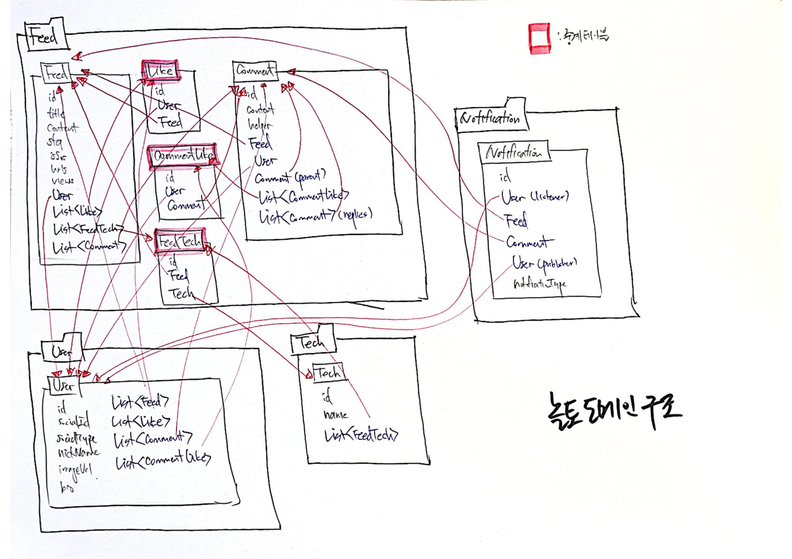

### 2021-11-09 놀토 정리

## 놀토 도메인 구조
- 
- **특징 및 아쉬운 점**
    1. 다대다 관계를 풀어내기 위한 중계 테이블 도입
        - Feed <- Like -> User 
            - 피드와 유저 사이의 좋아요는 다대다
            - 피드에 여러명의 유저가 좋아요를 누를 수 있고, 유저가 여러 피드에 좋아요를 누를 수 있음
            - 이를 Like라는 중계 테이블로 관리
        - Comment <- CommentLike -> User
            - 댓글과 유저 사이의 좋아요는 다대다
            - 댓글에 여러명의 유저가 좋아요를 누를 수 있고, 유저가 여러 댓글에 좋아요를 누를 수 있음
            - 이를 CommentLike라는 중계 테이블로 관리
        - Feed <- FeedTech -> Tech 
            - 피드와 테크 사이의 관계는 다대다. 
            - 이를 FeedTech로 관리

    2. 진짜 너무 많은 양방향...
        - 양방향이 많으면 관리포인트가 늘어남
            - 예상치 못한 동작들이 발생할 수 있음
            - ex. Feed가 지워지면, 거기에 달린 Comment를 cascade 옵션으로 지울라고 했는데...
                - ArgumentResolver에서 User를 조회해서 영속성 컨텍스트가 관리중에 있고, 
                - Feed를 지워도 User에게 남아있어서 못지웠다~
        - Id 참조를 들고 있게 해서 느슨한 결합으로 만들면 어땠을까?
        - 무지성 양방향 매핑을 지웠으면 어땠을까?
        - 단방향 역시 굳이 필요한게 아니면 끊었으면 어땠을까
            - Notification들이 Id 참조만 가지고 있도록

## 놀토 협업 과정

## 놀토의 깃 브랜치 전략

## 놀토의 예외처리 전략

## 놀토의 테스트 전략

## 놀토 인프라
1. Why replication?
2. Why load-balancing?

## 놀토 JPA
1. Persist + All로도 안사라짐
2. N+1
    - fetch
    - batchSize
3. 트랜잭션 At 테스트코드 XX
4. OrphanRemoval, CascadeOption

## 아쉬운점
- 테스트 코드에 왜 `@Transactional`을 쓴거냐?