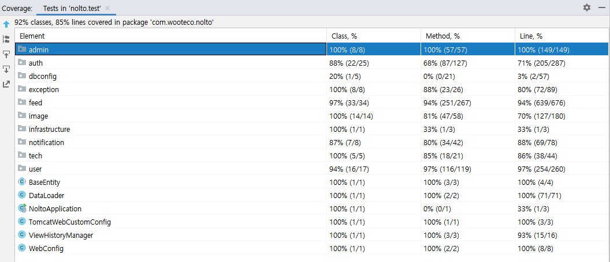

### 2021-11-10 놀토 정리

## 놀토의 예외처리 전략
- **1. 어플리케이션에서 발생하는 최상단 예외를 NoltoException으로 정의**
    ```java
    @Getter
    public class NoltoException extends RuntimeException {
        private final HttpStatus httpStatus;
        private final ExceptionResponse body;
    
        public NoltoException(HttpStatus httpStatus, ErrorType errorType) {
            super(errorType.getMessage());
            this.httpStatus = httpStatus;
            this.body = new ExceptionResponse(errorType.getErrorCode(), errorType.getMessage());
        }
    }
    ```  

- **2. ExceptionResponse를 만들어서 Exception의 body로 errorCode와 message를 줄 수 있도록 설정**
    ```java
    @Getter
    public class ExceptionResponse {
        private String errorCode;
        private String message;
        
        public ExceptionResponse(String errorCode, String message) {
          this.errorCode = errorCode;
          this.message = message;
        }
        
        public static ExceptionResponse of(ErrorType errorType) {
          return new ExceptionResponse(errorType.getErrorCode(), errorType.getMessage());
        }
    }
    ```

- **3. NoltoException을 상속하여 Error_Status_Code를 담은 에러를 만듬**
    ```java
    public class InternalServerErrorException extends NoltoException {
        public static final HttpStatus INTERNAL_SERVER_ERROR = HttpStatus.INTERNAL_SERVER_ERROR;
    
        public InternalServerErrorException(ErrorType errorType) {
            super(INTERNAL_SERVER_ERROR, errorType);
        }
    }
    
    public class NotFoundException extends NoltoException {
        public static final HttpStatus NOT_FOUND = HttpStatus.NOT_FOUND;
    
        public NotFoundException(ErrorType errorType) {
            super(NOT_FOUND, errorType);
        }
    }
    ```

- **4. Enum으로 예외를 관리하기**
    - 예외 생성할 때 생성자로 해당 ErrorType을 넣어줘야함
    - 프론트와 합의함에 따라, errorCode
    ```java
    @Getter
    @RequiredArgsConstructor
    public enum ErrorType {
        DATA_BINDING_ERROR("common-001", "요청값이 잘못되었습니다."),
        INVALID_TOKEN("auth-001", "유효하지 않은 토큰입니다."),
        FEED_NOT_FOUND("feed-001", "존재하지 않는 피드입니다."),
        NOT_SUPPORTED_IMAGE("image-001", "지원하지 않는 이미지 입니다."),
        ALREADY_LIKED("like-001", "이미 좋아요 누른 글 입니다."),
        COMMENT_NOT_FOUND("comment-001", "존재하지 않는 댓글입니다."),
        ALREADY_EXIST_NICKNAME("member-001", "이미 존재하는 닉네임입니다."),
    
        private final String errorCode;
        private final String message;
    }
    ```
  
- **5. ControllerAdvice에서 처리해주기**
    ```java
    @ExceptionHandler(NoltoException.class)
    public ResponseEntity<ExceptionResponse> handleNoltoException(NoltoException e) {
        log.info(e.getBody().getMessage());
        return ResponseEntity.status(e.getHttpStatus()).body(e.getBody());
    }
    ```

## 놀토의 테스트 전략
- **테스트 커버리지**
    - 

- **테스트 전략**
    - Layer별 슬라이스 테스트 + RestAssured를 활용한 통합 테스트

- **컨트롤러 테스트**
    - `@WebMvcTest` + `@MockBean`을 통해 작성
        - `@WebMvcTest`
            - 컨트롤러가 똑바로 동작하는지 확인하기 위함
            - 다음과 같은 내용만 스캔하여 가벼운 테스트 가능
                - `@Controller`, `@ControllerAdvice`, `@JsonComponent`, 
                - Converter, GenericConverter, Filter, HandlerInterceptor, 
                - WebMvcConfigurer, HandlerMethodArgumentResolver
        - `@MockBean`
            - 따라서 구동에 필요한 서비스 클래스등은 모킹해줘야함
    - SpringRestDocs를 활용하기 위함도 있음
        - *참고: https://techblog.woowahan.com/2597/*

- **서비스 테스트**
    - 필요에 따라 다음과 같은 어노테이션 활용
        - `@ActiveProfiles("test")` : yml 테스트 프로퍼티 환경에서 돌리기 위함
        - `@SpringBootTest` : 실제 스프링 구동환경에서 사용될 Bean을 띄워놓고 테스트하기 위함
        - `@Transactional` : 테스트 이후 롤백을 위함
        - `@TestConstructor(autowireMode = TestConstructor.AutowireMode.ALL)` : `@Autowired`가 없어도 주입해주세요
        - `@DirtiesContext(classMode = DirtiesContext.ClassMode.BEFORE_EACH_TEST_METHOD)` : 어플리케이션 컨텍스트를 재구동해야할 경우

- **도메인 단위 테스트**
    - Junit5 기반의 단위 테스트
    - 도메인의 기능들에 대한 테스트케이스 작성

- **리포지토리 테스트**
    - `@DataJpaTest` 활용
    - JPQL이 제대로 동작하는지 확인용도로 주로 씀

- **통합 테스트**
    - 시나리오 기반의 RestAssured 통합테스트
    - 독립적인 테스트 환경을 보장하고자 `@DirtiesContext`를 활용했지만, 새로운 어플리케이션 컨텍스트는 많은 시간 소요
        - 결국 매 테스트 마다 DB 제거를 해주는게 중요하다라고 판단해 개선점 찾아봄
        - DatabaseCleanup이라는 빈을 활용해, 매 테스트마다 DB를 제거해주도록 개선
        - 6분 30초 가량 소요되던 빌드 1분 30초로 단축
        ```java
        @Service
        @ActiveProfiles("test")
        class DatabaseCleanup implements InitializingBean {
        
            @PersistenceContext
            private EntityManager entityManager;
        
            private List<String> tableNames;
        
            @Override
            public void afterPropertiesSet() {
                tableNames = entityManager.getMetamodel().getEntities().stream()
                        .filter(e -> e.getJavaType().getAnnotation(Entity.class) != null)
                        .filter(e -> e.getJavaType().getAnnotation(Table.class) == null)
                        .map(e -> CaseFormat.UPPER_CAMEL.to(CaseFormat.LOWER_UNDERSCORE, e.getName()))
                        .collect(Collectors.toList());
                List<String> tableNamesWithAnnotation = entityManager.getMetamodel().getEntities().stream()
                        .filter(e -> e.getJavaType().getAnnotation(Table.class) != null)
                        .map(e -> CaseFormat.UPPER_CAMEL.to(CaseFormat.LOWER_UNDERSCORE, e.getJavaType().getAnnotation(Table.class).name()))
                        .collect(Collectors.toList());
                tableNames.addAll(tableNamesWithAnnotation);
            }
        
            @Transactional
            public void execute() {
                entityManager.flush();
                entityManager.createNativeQuery("SET REFERENTIAL_INTEGRITY FALSE").executeUpdate();
        
                for (String tableName : tableNames) {
                    entityManager.createNativeQuery("TRUNCATE TABLE " + tableName).executeUpdate();
                    entityManager.createNativeQuery("ALTER TABLE " + tableName + " ALTER COLUMN ID RESTART WITH 1").executeUpdate();
                }
        
                entityManager.createNativeQuery("SET REFERENTIAL_INTEGRITY TRUE").executeUpdate();
            }
        }
        ```
        - 최상단 AcceptanceTest의 `@BeforeEach`에서 databaseCleanup.execute(); 실행
    - 공통된 로직은 AcceptanceTest로 올려버림
    - static 메서드로 여기저기서 쓰일 수 있는 메서드들은 개방해줌

- **아쉬운 점**
    - 서비스 테스트에 클래스 단위로 통째로 `@Transactional`을 쓴 것
        - 서비스 테스트를 슬라이스 테스트로 구현하지 못한 것 같아
        - given, setUp에 대해서 싹 다 객체 엔티티로 관리해버리고 하나의 영속성 컨텍스트에서 관리해줬어
        - 즉, 통합테스트 마냥 쓰다보니 em.flush(), em.clear()를 통해 의도적으로 영속성 컨텍스트 관리해줘야 했었어
        - 테스트하고자 하는 when 절이 생각보다 똑바로 동작안하더라고

## 놀토의 로깅 전략

## 놀토 인프라
1. Why replication?
2. Why load-balancing?

## 놀토 JPA
1. Persist + All로도 안사라짐
2. N+1
    - fetch
    - batchSize
3. 트랜잭션 At 테스트코드 XX
4. OrphanRemoval, CascadeOption
