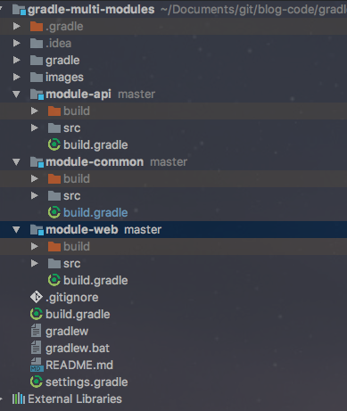

### 2021-11-16

## Gradle 멀티 모듈 기초
- **미션 요구사항**
    - 컨텍스트 간의 독립된 모듈로 만들 수 있음
    - 의존성 주입, HTTP 요청/응답, 이벤트 발행/구독 등 다양한 방식으로 모듈 간 데이터 주고 받을 수 있음
    
----

- *참고: https://jojoldu.tistory.com/123*
- **프로젝트 분리?**
    - 일정 수준 이상의 트래픽을 감당하려면 분리해야함
    - 그럼 여기저기서 사용되는 클래스들은 어찌하지?
        1. 복붙
            - 실수할 여지 너무 많음
        2. 공통 프로젝트를 두고, 해당 프로젝트를 여러 프로젝트에서 가져가서 사용
            - 개발시에는 바로바로 공통 프로젝트 코드를 사용할 수 있어야 함
            - 빌드시에는 자동으로 공통 프로젝트가 포함되어야 함
            - Gradle의 **Multi Module** 방식을 사용하여 해결 가능
    
- **예시**
    - 
    - 루트: `gradle-multi-modules`
        - 하위: `module-api`
        - 하위: `module-web`
        - 하위: `module-common` <= 이놈이 공통 클래스 모아둔 프로젝트
    - 루트에서만 빌드하기 때문에, 루트에서만 gradle 폴더/gradlew 파일이 있음
    - 실습
        - `module-common` 에서 Member 엔티티, MemberRepository 작성
        - `module-api` 에서 MemberService 작성
        - `gradle-multi-modules` 의 `settings.gradle` 에서 아래 코드 추가
        ```
        rootProject.name = 'gradle-multi-modules'
        include 'module-common', 'module-api', 'module-web'
        ```
        - `gradle-multi-modules` 의 `build.gradle` 을 다음과 같이 수정
            - `subprojects` : `settings.gradle`에 include 된 프로젝트 관리
            - `project()` : 하위 프로젝트간의 의존성 관리
        ```
        buildscript {
            ext {
                springBootVersion = '1.5.1.RELEASE'
            }
            repositories {
                mavenCentral()
            }
            dependencies {
                classpath("org.springframework.boot:spring-boot-gradle-plugin:${springBootVersion}")
                classpath "io.spring.gradle:dependency-management-plugin:0.6.0.RELEASE"
            }
        }
        
        subprojects {
            group 'com.blogcode'
            version '1.0'
        
            apply plugin: 'java'
            apply plugin: 'spring-boot'
            apply plugin: 'io.spring.dependency-management'
        
            sourceCompatibility = 1.8
        
            repositories {
                mavenCentral()
            }
        
            dependencies {
                testCompile group: 'junit', name: 'junit', version: '4.12'
            }
        }
        
        project(':module-api') {
            dependencies {
                compile project(':module-common')
            }
        }
        
        project(':module-web') {
            dependencies {
                compile project(':module-common')
            }
        }
        ```

----
- *참고: https://velog.io/@sangwoo0727/Gradle%EC%9D%84-%EC%9D%B4%EC%9A%A9%ED%95%9C-%EB%A9%80%ED%8B%B0-%EB%AA%A8%EB%93%88*
- **왜 필요하지?**
    - 독립적인 프로젝트 만들었는데, 여기서 겹치는 클래스들 다수 발생
        - api 서버에도, 배치 서버에도 Member 엔티티가 필요

- **멀티 모듈**
    - 독립된 프로젝트 단위이기 때문에, 도메인 공유가 불가
        - 같은 도메인을 프로젝트에 두곤햇어...
    - 멀티 모듈 도입하면 독립적인 프로젝트를 하나의 프로젝트 안의 "모듈" 로서 가짐
    
- **과정**
    - 새로운 프로젝트 생성
        - Gradle 이용하여 프로젝트 만듦
    - 신규 모듈 생성
        - New - Module 을 선택해 Gradle 모듈 생성
        - 기존 Root 프로젝트의 src 폴더 삭제
        - 각 모듈에는 `build.gradle`과 src 만 존재하도록
    - 각 모듈에 필요한 의존성 추가
        - 하위 모듈... boot jar = false, jar = true
        ```
        bootJar  {  enabled = false }
        jar  {  enabled = true  } 
        ```
        - 각각의 모듈의 역할에 맡는 의존성 주입
    - root 프로젝트의 `build.gradle`
        - subprojects : settings.gradle에 포함된 프로젝트를 관리하는 곳
            - 루트까지 적용할라면 allprojects로 작성
            ```
            subprojects {
                group 'io.hala'
                version '1.0'
            
                apply plugin: 'java'
                apply plugin: 'org.springframework.boot'
                apply plugin: 'io.spring.dependency-management'
            
                sourceCompatibility = 11
            
                repositories {
                    mavenCentral()
                }
            
                dependencies {
                    compileOnly 'org.projectlombok:lombok'
                    annotationProcessor 'org.projectlombok:lombok'
                    implementation 'org.springframework.boot:spring-boot-starter-test'
                }
            }
            ```
        - project() : 하위 의존성 관리
            - `module-api` 와 `module-batch` 에서 `module-common` 추가해 줌 (`module-common` 사용가능)
            ```
            project(':module-api') {
                dependencies {
                    compile project(':module-common')
                }
            }
            
            project(':module-batch') {
                dependencies {
                    compile project(':module-common')
                }
            }
            ```
